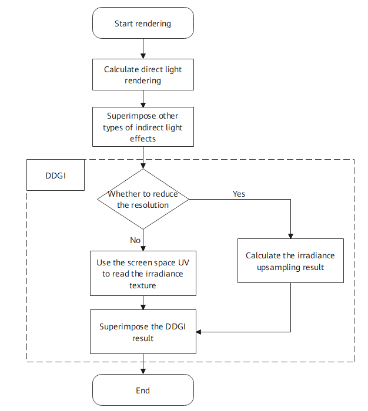
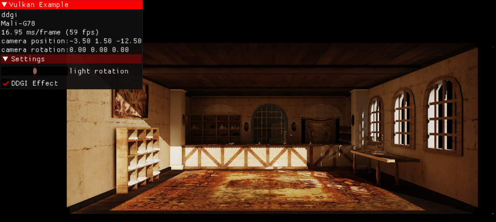

# DDGI SDK Sample Code
English | [中文](README_ZH.md)

## Contents

 * [Introduction](#Introduction)
 * [Compilation](#Compilation)
 * [Example](#Example)
 * [Reference Projects](#Reference-Projects)
 * [License](#License)

## Introduction

This project demonstrates how to apply the Dynamic Diffuse Global Illumination (DDGI) SDK provided by Huawei to a forward rendering pipeline on a mobile device to improve the texture quality. References include the Vulkan example[[1\]](https://github.com/SaschaWillems/Vulkan) of SaschaWillems, PBR of Learn OpenGL[[2\]](https://learnopengl.com/PBR/Theory), and DDGI algorithm implementation of NVIDIA RTXGI[[3\]](https://https://github.com/NVIDIAGameWorks/RTXGI).

The following video shows the effect of enabling DDGI for a room model on Mate 40 Pro.

(To obtain the room model, click [here](https://sketchfab.com/3d-models/room-266d02119c494b4cbaf759d774df8494); license: CC Attribution)


## Compilation

**Android/HarmonyOS:**

1. Development environment
   - Android Studio 4.0 or later
   - NDK 20.1.5948944 or later
   - Android SDK 29.0.0 or later

Set the environment variables **ANDROID_HOME** and **ANDROID_NDK_HOME** to point to the Android SDK directory and NDK directory, respectively.

2. Compilation and running
   1. Using the IDE: Use Android Studio to open the `android` directory, connect to the mobile phone, and click **Run** or press **Shift**+**F10** to execute the code. The generated APK file is archived in the **android\examples\bin** directory.
   2. Using the CLI: Connect to the phone using a USB cable, enable the ADB mode, and run the following commands:

```
cd android
call .\gradlew clean
call .\gradlew installDebug 	# or `call .\gradlew assembleDebug` for just build apk
adb shell am start -n "com.huawei.ddgi.vkExample/.VulkanActivity"
```

**Windows:**

1. Development environment
   - Visual Studio 2019 or later
   - Vulkan SDK 1.2.176.1 or later
   - CMake 3.16 or later
2. Perform CMake compilation in the directory where the **CmakeLists.txt** file of the project is located, open the **ddgi-sample.sln** file generated after compilation, right-click **DDGIExample**, and choose **Set StartUp Projects** from the shortcut menu.

Note: If the shader code of the project is modified, run the following command for an update:

`python3 .\data\shaders\glsl\compileshaders.py`

## Example

This example superimposes the indirect light effect of DDGI on the forward rendering pipeline. The following figure shows the procedure.



To apply DDGI, three phases are involved:

- Initialization: Set the Vulkan environment information and initialize the DDGI SDK.
- Preparations:
  - Create textures. One is for saving the DDGI effect and one is for saving the normal and depth. Then set the resolutions and pass the textures to the DDGI SDK.
  - Convert the rendering data into the format required by the DDGI SDK, call the correct function to pass the data to the DDGI SDK, and call the **Prepare** function of the DDGI SDK to parse the input data.
  - Set parameters of the DDGI algorithm and pass them to the DDGI SDK.
- Rendering:
  - Update the camera and light source information.
  - Call the **Render** function of the DDGI SDK to perform rendering. The rendering result will be saved in the textures created in the preparations phase.

The final result of direct lighting and DDGI indirect lighting is shown in the following figure.



## Reference Projects

[1] [SaschaWillems/Vulkan](<https://github.com/SaschaWillems/Vulkan>)

[2] [learnOpenGL/PBR](https://learnopengl.com/PBR/Theory)

[3] [Nvidia/RTXGI](https://github.com/NVIDIAGameWorks/RTXGI)

## License

The sample code is licensed under Apache License 2.0. For details about the license, please refer to [LICENSE.md](https://github.com/HMS-Core/hms-scene-DDGI-demo/blob/main/LICENSE).
