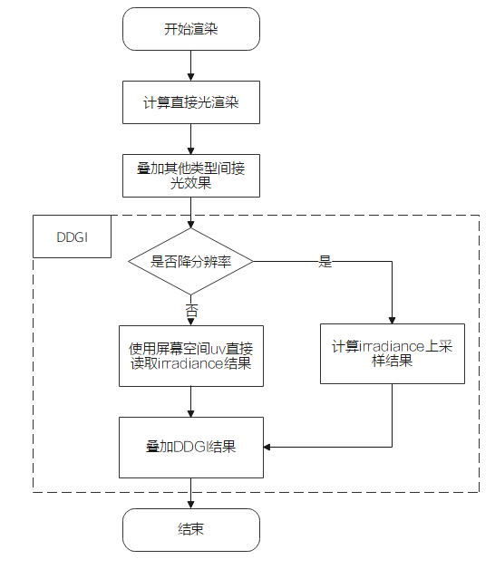
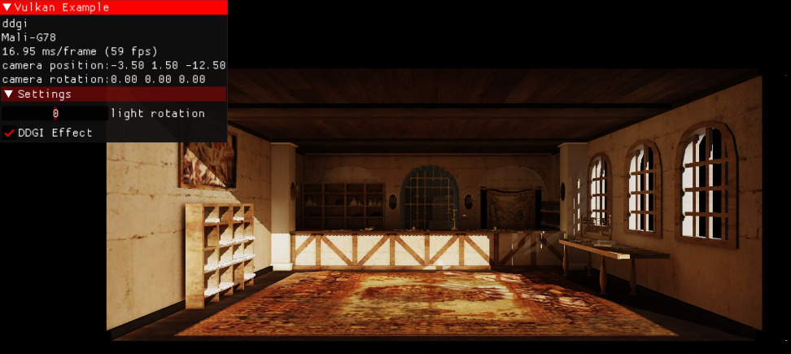

# DDGI(动态漫反射全局光照) 使用示例代码
[English](README.md) | 中文

## 目录

 * [简介](#简介)
 * [编译](#编译)
 * [例子](#例子)
 * [参考项目](#参考项目)
 * [技术支持](#技术支持)
 * [许可证](#许可证)

## 简介

本项目主要是用于展示如使用华为提供的移动端动态漫反射全局光照（DDGI），在前向管线上实现动态光照漫反射全局照明的效果，提升场景画质。项目中关于Vulkan的管线借鉴了SaschaWillems的VulkanExample<sup>[\[1\]](https://github.com/SaschaWillems/Vulkan)</sup>项目，例子中关于PBR部分知识参考了LearnOpenGL<sup>[\[2\]](https://learnopengl-cn.github.io/07%20PBR/02%20Lighting/#pbr)</sup>, DDGI算法的实现参考了英伟达RTXGI<sup>[\[3\]](https://github.com/NVIDIAGameWorks/RTXGI)</sup>。

Room场景上使能DDGI的效果如下，运行平台：Mate 40 Pro。

（为获得该房间模型，click [here](https://sketchfab.com/3d-models/room-266d02119c494b4cbaf759d774df8494); License: CC Attribution）


## 编译

**Android / HarmonyOS：**

1. 开发环境
   - Android Studio 4.0及以上版本
   - NDK 20.1.5948944及以上版本
   - Android SDK 29.0.0及以上版本
   - Java JDK 1.8.0及以上版本

设置环境变量ANDROID_HOME ANDROID_NDK_HOME分别指向 Android SDK目录和NDK目录。

2. 编译运行
   1. 使用IDE：用Android Studio打开`android`目录，连接手机，点击运行按钮或快捷键Shift+F10即可执行代码。生成的apk文件归档在android\examples\bin目录下。
   2. 使用命令行：USB连接手机，开启ADB调试模式，执行以下命令：

```
cd android
call .\gradlew clean
call .\gradlew installDebug 	# or `call .\gradlew assembleDebug` for just build apk
adb shell am start -n "com.huawei.ddgi.vkExample/.VulkanActivity"
```

**Windows：**

1. 开发环境
   - Visual Studio 2019及以上版本
   - Vulkan SDK 1.2.176.1及以上版本
   - CMake 3.16及以上版本
   - Python 3.6.0及以上版本
2. 在工程的CMakeLists.txt所在目录执行CMake编译，打开编译后生成的"ddgi-sample.sln"文件（通常在build目录下），右键点击“DDGIExample”并将其设置为启动项目运行即可。

注意：如果对该工程的shader代码有修改，请执行以下指令进行编译更新：

`python .\data\shaders\glsl\compileshaders.py`

## 例子

本例子在前向渲染管线的基础上，叠加了DDGI的间接光效果，具体流程如下图：



DDGI的总体分为以下三个阶段：

- 初始化阶段：设置Vulkan环境信息，初始化DDGI SDK。
- 准备阶段：
  - 创建保存结果的纹理：分别创建用于保存全局漫反射光照和法线深度的纹理，设置其分辨率，并输入到DDGI SDK；
  - 准备并解析渲染场景数据：将用户渲染数据转换成DDGI SDK要求的格式，并调用相应函数输入到DDGI SDK，然后调用DDGI SDK的Prepare函数解析输入的数据；
  - 设置DDGI算法的参数并输入到DDGI SDK。
- 渲染阶段：
  - 更新相机和光源信息；
  - 调用DDGI SDK的Render函数进行渲染，渲染结果保存在准备阶段创建的纹理中。

最终，直接光+DDGI间接光的结果如图所示：



## 参考项目

[1] [SaschaWillems/Vulkan](https://github.com/SaschaWillems/Vulkan)

[2] [learnOpenGL/PBR](https://learnopengl-cn.github.io/07%20PBR/02%20Lighting/#pbr)

[3] [Nvidia/RTXGI](https://github.com/NVIDIAGameWorks/RTXGI)

## 技术支持

如果您对HMS Core还处于评估阶段，可在[Reddit社区](https://www.reddit.com/r/HuaweiDevelopers/)获取关于HMS Core的最新讯息，并与其他开发者交流见解。

如果您对使用HMS示例代码有疑问，请尝试：

- 开发过程遇到问题上[Stack Overflow](https://stackoverflow.com/questions/tagged/huawei-mobile-services?tab=Votes)，在`huawei-mobile-services`标签下提问，有华为研发专家在线一对一解决您的问题。
- 到[华为开发者论坛](https://developer.huawei.com/consumer/cn/forum/blockdisplay?fid=18) HMS Core板块与其他开发者进行交流。

如果您在尝试示例代码中遇到问题，请向仓库提交[issue](https://github.com/HMS-Core/hms-scene-fine-grained-demo/issues)，也欢迎您提交[Pull Request](https://github.com/HMS-Core/hms-scene-fine-grained-demo/pulls)。

## 许可证

DDGI示例代码采用的许可证为Apache License, version 2.0，参考 [LICENSE.md](LICENSE) 获取更多许可证信息。
